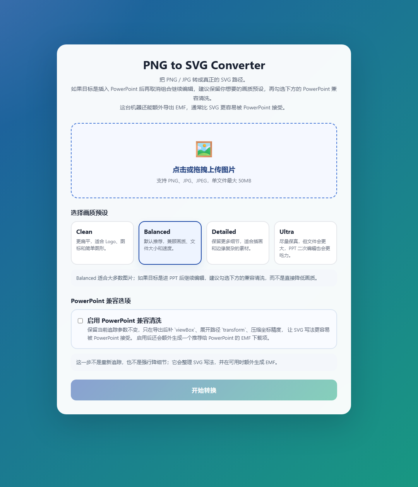
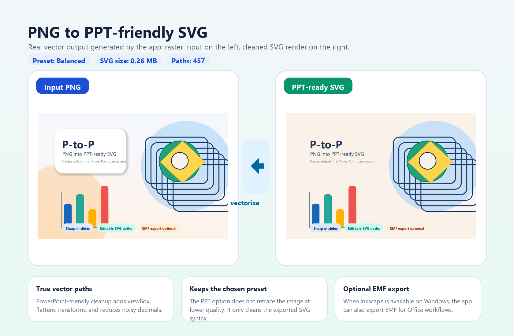

# P-to-P

> 把 `PNG / JPG` 转成 **PowerPoint 更容易接受的 SVG**。  
> 输出是真正的矢量路径，不再是过去那种“位图塞进 PPT” 的方式。

中文 | [English](README_EN.md)






## ✨ 功能介绍

`P-to-P` 是一个面向演示文稿场景的图片转矢量工具，适合把普通的 `PNG / JPG` 图片处理成更适合插入 `PowerPoint` 的 `SVG`。

- 🖼️ 把位图图片转换成真正的 `SVG` 路径，放大后依然清晰
- 🧩 支持 `Clean / Balanced / Detailed / Ultra` 多种画质预设
- 🪄 提供 **PowerPoint 兼容清洗**，自动整理 SVG 写法，让 Office 更容易接受
- 📏 自动补全 `viewBox`、展平 `transform`、压缩坐标精度
- 📊 支持质量评估，可查看 `SSIM / PSNR / 综合分数`
- 💾 转换完成后可直接下载 `SVG`
- 🧷 在 Windows 且安装 `Inkscape` 时，还可以额外导出 `EMF`

适合场景：

- 📌 把 PNG 素材转成 PPT 可插入、可缩放的矢量图
- 🎨 处理 Logo、图标、插画、示意图等常见办公素材
- 🔍 避免位图放大后发虚、锯齿明显的问题

## 🚀 快速开始

### 本地运行

```bash
git clone https://github.com/bloom-lmh/p-to-p.git
cd p-to-p

pip install -r requirements.txt
python app.py
```

打开浏览器访问：`http://127.0.0.1:5000`

### Docker 运行

```bash
git clone https://github.com/bloom-lmh/p-to-p.git
cd p-to-p

docker-compose up -d
```

打开浏览器访问：`http://127.0.0.1:5000`

### 使用步骤

1. 上传 `PNG / JPG` 图片
2. 选择合适的画质预设
3. 如果目标是 `PowerPoint`，勾选“PowerPoint 兼容清洗”
4. 点击转换并下载结果
5. 如果页面提供 `EMF`，也可以直接下载用于 Office

## 📦 导出模式说明

| 模式 | 说明 | 适合场景 |
| --- | --- | --- |
| `SVG` 普通导出 | 按当前预设直接生成 SVG 矢量路径 | 网页、设计稿、通用矢量用途 |
| `SVG` + PowerPoint 兼容清洗 | 不改变追踪预设，只对导出的 SVG 做兼容整理 | 需要插入 PPT、提高导入成功率 |
| `EMF` 导出（可选） | 在清洗后的 SVG 基础上额外导出 EMF | Windows 下更常见的 Office 使用场景 |

补充说明：

- 🛠️ `PowerPoint 兼容清洗` 不是重新低质量追踪，而是整理 SVG 结构
- ⚖️ 如果你更在意细节，优先把预设调到 `Detailed` 或 `Ultra`
- 📎 如果某些 PowerPoint 版本对 SVG 支持一般，优先尝试 `EMF`

---

如果这个项目对你有帮助，欢迎点一个 `Star`。
